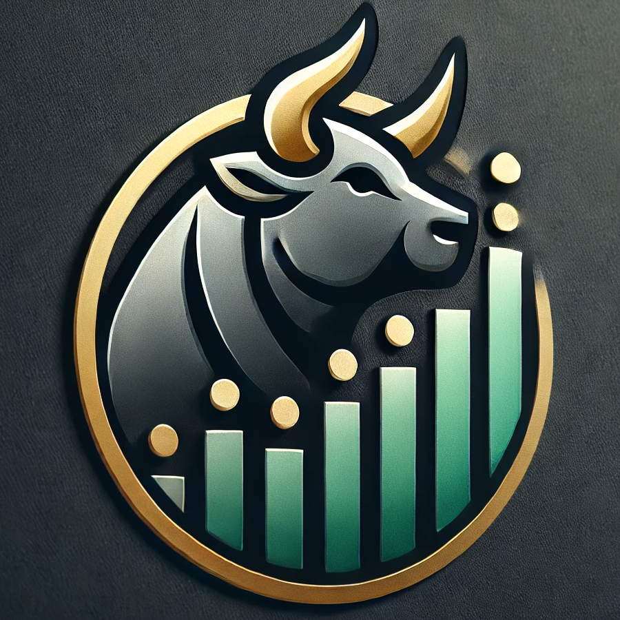

# 🐂 📈 🔁 BullStockOps


Welcome to **BullStockOps**, a personal open-source project combining cutting-edge AI, financial analytics, and scalable software operations to revolutionize day trading.
<p align="center">

</p>

## 👀 Project Overview

**BullStockOps** is designed to empower traders with AI-driven insights and seamless trading operations. From stock price predictions to AI-assisted trade execution, this project provides a robust platform for experimentation and learning.

### MVP1 Goals
- ➡️ Display real-time stock prices in a web and iOS app.

#### Features backlog
- 📊 Stock Market Data Integration: Access real-time and historical data through APIs (e.g., Alpha Vantage).
- 📈 Predictive Analytics: Build LSTM-based models to forecast stock prices.
- 🤖 AI-Assisted Trading: Develop AI agents for automated trading decisions.
- 📱 iOS App Development: Leverage Apple Core ML and MLX for offline and online ML features.

## 🏗️ Architecture

## ⚙️ Tech Stack
- Backend:Python 3.13, uv, FastAPI, Pydantic
- Frontend:	React & TypeScript
- Mobile: Apple Core ML, MLX, Swift
- AI Models	GPT-4, Claude, Gemini

## 💻 Setup
1. Update or install [uv](https://docs.astral.sh/uv/) using
```shell
brew install uv
```
2. Install this project's dependencies and activate project's venv in your shell
```shell
uv sync
source .venv/bin/activate
```
3. Add keys (see [dotenvx](https://dotenvx.com/docs/quickstart))
- https://www.alphavantage.co/support/#api-key
```shell
echo "ALPHA_VANTAGE_KEY=your_key_here" > .env
dotenvx encrypt
dotenvx ext gitignore --pattern .env.keys
```
